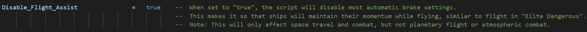
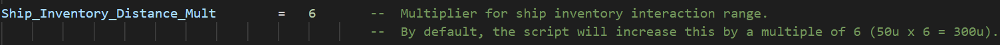
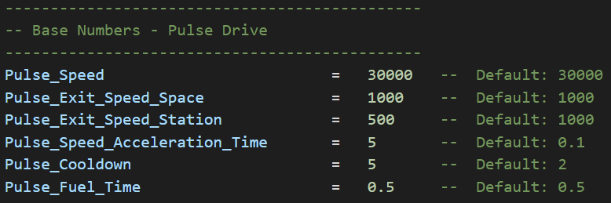

# Hypn0tick Modular Flight Framework

A mod script and framework for No Man's Sky flight-related mods using the [AMUMSS Framework](https://github.com/HolterPhylo/AMUMSS), a LUA script-based mod builder that can build modifications using the game's (and other mods') latest files.

This script should allow both mod authors and users to create and share alterations to NMS's flight settings more easily than ever before. Every parameter controlling all aspects of flight in NMS have been mapped out into convenient variables for authors, and even simpler multipliers for users. In the following sections, we will go over the script's sections and main functions.

For more information on modding No Man's Sky, using AMUMSS, fixing bugs, and much more, feel free to join the [NMS Modding Discord](https://discord.gg/5Bb3pYYVyV). For LUA script examples, check out the [AMUMSS Standard Collection](https://github.com/MetaIdea/nms-amumss-lua-mod-script-collection/tree/main/amumss-standard-collection), which includes various helpful learning examples, and the general [AMUMSS LUA Mod Script Collection](https://github.com/MetaIdea/nms-amumss-lua-mod-script-collection).

## What is AMUMSS?

The parameters that control most aspects of NMS' gameplay are stored in various ".mbin" files, which are subsequently compressed, packed into ".pak" files and read by the game. The game can ultimately read only one instance of each file, however, and therefore doesn't allow multiple mods to edit the same file. Editing the game's files directly also forces mod authors to manually update their work whenever the game's updates introduces new changes to those them. Further, it nearly impossible to create customize-able mods in this scenario. AMUMSS fixes these issues by modifying the game's latest files using a series of instructions provided by a LUA script.

AMUMSS is the software responsible for turning ".lua" files into proper mods. It does so in a few (automated) steps:

1. First, it unpacks the game's (and/or other mods') .pak archives which contain ".mbin" files changed by a script.

2. Next, it uses MBINCompiler.exe to convert them into legible ".exml" files.

3. Then, it modifies these files according to instructions provided by the ".lua" files it finds in the "ModScript" folder.

4. Finally, it will use MBINCompiler.exe to convert them back into the ".mbin" files read by the game, and re-archives them into ".pak" files.

This approach is extremely beneficial in many ways. For example, it allows multiple script-based mods to alter the same files while ensuring compatibility with each other; will work across game updates (for the most part), making the same changes to the latest game files; and allows users to tweak and customize scripts to their liking.

## What is the Modular Flight Framework?:

This AMUMSS script serves as a framework with which flight-related mods for No Man's Sky can be both created easily by mod authors, and later fine-tuned by users in the simplest possible manner.

## Features:

- Modular features that can be enabled/disabled individually.

- Control values using multipliers (simpler) or by inputting base numbers, which will automatically be applied to the correct parameters in the game's files.

- Easily modify space flight parameters (speed, maneuverability, and more).
  
  - Separately modify parameters for space, combat, planetary, and atmospheric flight.
  
  - Disable automatic avoidance & orientation limits.
  
  - Disable "flight assist", which makes ships travel through space as if they were in atmospheric conditions. When disabled, ships will retain their momentum during space travel.
  
  - Modify pulse & warp drive settings.
  
  - Modify asteroid damage.
  
  - Disable asteroid generation when using the pulse drive.
  
  - Disable speed lines during pulse & warp travel.

- Easily modify planetary & atmospheric flight parameters.
  
  - Enable hovering & reversing when flying on planets.
  
  - Enable low or underwater flight.
  
  - Modify ship launch fuel cost.
  
  - Modify ship inventory & teleporter distances.
  
  - Modify ship scanner parameters.

- Modify freighter settings.
  
  - Remove multiplayer freighter limit (typically 1 per system).
  
  - Ensure that a system's first freighter spawn will be its capital freighter.
  
  - Modify planetary summon distance & tractor range.
  
  - Modify warp drive ranges & bonuses.

- And more!

## Usage:

If you are simply looking to install a mod created with Modular Flight and <u>**do not** have any conflicting packed (.pak) mods</u> in your NMS mod folder (No Man's Sky\GAMEDATA\PCBANKS\MODS) that edit the same files, I recommend simply downloading the ".pak" file provided by the mod author and using it as-is.

If you are looking to fine-tune or otherwise modify the values of a mod created with Modular Flight, or to create your own mod(s) using the framework, you will need to download and utilize the [AMUMSS Framework](https://github.com/HolterPhylo/AMUMSS), as described below. Then, simply download the script file (Hypn0tick_Modular_Flight.lua) to your AMUMSS "Modscript" folder, modify the values to your liking, and build the mod.

### Installation:

To begin creating, modifying, and/or building LUA-based mods for No Man's Sky, you will need to follow a few basic steps:

#### Install Dependencies

AMUMSS uses [*MBINCompiler.exe*](https://github.com/monkeyman192/MBINCompiler) to compile and decompile the game's ".mbin" files to and from legible ".exml" files, which requires the [.NET 5 Desktop Runtime](https://dotnet.microsoft.com/en-us/download/dotnet/5.0/runtime) to run properly.

- [Download .NET 5.0 Desktop Runtime - Windows x64 Installer](https://dotnet.microsoft.com/en-us/download/dotnet/thank-you/runtime-desktop-5.0.17-windows-x64-installer)

- [Download .NET 5.0 Desktop Runtime - Windows x86 Installer](https://dotnet.microsoft.com/en-us/download/dotnet/thank-you/runtime-desktop-5.0.17-windows-x86-installer)

#### Download & Update AMUMSS & MBINCompiler

1. [Download the latest AMUMSS](https://github.com/HolterPhylo/AMUMSS/releases) and extract it to the folder of your choice.

2. In the AMUMSS folder, open the "BUILDMOD.bat" file.

3. When asked whether you would like to update AMUMSS, type "Y". Afterwards, press any key to close the terminal and check for updates.
   
   - You may need to do this multiple times if the update doesn't apply.

4. Open the "BUILDMOD.bat" file again. If it updated correctly, AMUMSS will then create a list of your game's ".pak" files and automatically download the latest MBINCombiler.exe. If everything updated correctly, you should see the terminal output something similar to this:

#### Download the Modular Flight Framework

[Download the script](https://github.com/hypn0tick/nms-amumss-lua-mods/blob/main/Hypn0tick%20Mods/Modular%20Flight/Hypn0tick_Modular_Flight.lua) to your AMUMSS "ModScript" folder. If you struggle to download the file, simply [copy its contents](https://raw.githubusercontent.com/hypn0tick/nms-amumss-lua-mods/main/Hypn0tick%20Mods/Modular%20Flight/Hypn0tick_Modular_Flight.lua) into a new ".lua" file in your "ModScript" folder.

You are now ready to build LUA script-based mods for No Man's Sky!

### Building the Mod:

Now that you have downloaded AMUMSS and the Modular Flight script, turning the script into a useable mod is a very simply process. With the script's ".lua" file in your AMUMSS "ModScript" folder, simply run "BUILDMOD.bat" to create a modded ".pak" file.

When you run AMUMSS, it will ask whether to automatically copy the created ".pak" file to your NMS "MODS" folder and delete the "DISABLEMODS.txt" file from the game's "PCBANKS" folder. If you choose not to, simply move the newly-created file from the AMUMSS "CreatedModPAKs" folder to the game's "GAMEDATA\PCBANKS\MODS" folder and delete the "GAMEDATA\PCBANKS\DISABLEMODS.txt" file. Your game will now start with the mod enabled. 

### Creating & Modifying Modular Flight Mods

To create a mod with the Modular Flight Framework, or to alter an existing mod created with the script, you will want to follow the installation instructions above. Before building the mod, however, you can open the Modular Flight ".lua" file to configure every aspect of flight in No Man's Sky individually. Specifics regarding the file's data & sections are included below. After making your desired changes, simply build the mod as explained above and enjoy the results in-game.

## Framework Script Contents

To simplify the process of editing the script's data, it has been separated into three different sections: <u>general settings & multipliers, base numbers, and code.</u>

### General Settings & Multipliers

The "general settings & multipliers" section is likely to be the only one touched by the vast majority of mod users. It primarily contains various booleans (true/false statements) that control the script's features, and multipliers that alter associated values.

<u>**Example Boolean:**</u>

<u>**Example Multiplier:**</u> 

### Base Numbers

The second section, base numbers, houses all of the default data used by the script and its modifiers. This section exists for mod authors to more easily alter these values without the need to change any code. By modifying this section (as opposed to the first), mod authors also allow their users to more easily tweak their mod's values using the multipliers in the first section without the need to create any code.

<u>**Example Base Numbers:**</u>

### Code

The final section, code, contains all of the script's logic. While I encourage users and mod authors to peruse the code for the sake of understanding (and potentially help to find any bugs I may have overlooked), changes to this section of the script should be largely unnecessary as everything is controlled by the prior sections.
